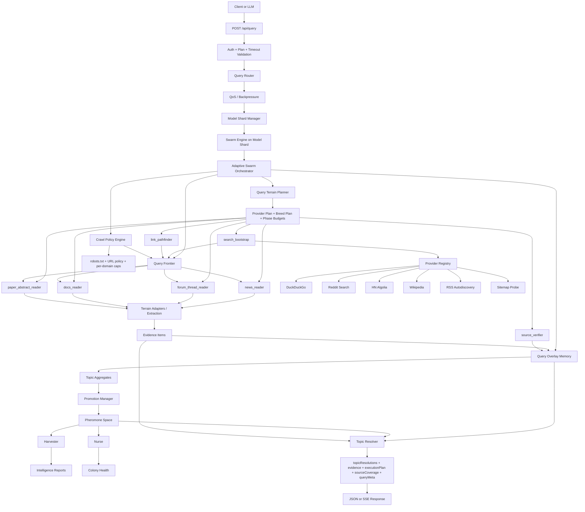

# @rylvo/swarm-core

Adaptive open-web stigmergic runtime for evidence-ranked topic discovery.

## What This System Is

This system is not a traditional crawler and not a plain search wrapper.

It is a query-driven runtime that:

1. accepts a query from a user or LLM,
2. chooses a search strategy for that query,
3. discovers public-web sources under a strict time budget,
4. extracts evidence from those sources,
5. aggregates that evidence into local topic competition,
6. promotes only corroborated topics into shared pheromone memory,
7. returns structured results with evidence, coverage, and timing.

The main request path is:

- `POST /api/query` in `src/swarm-api.ts`
- `SwarmEngine.executeQuery(...)` in `src/swarm-engine.ts`
- `AdaptiveSwarmOrchestrator.execute(...)` in `src/runtime/adaptive-swarm-orchestrator.ts`

## Quick Start

```bash
cd swarm-core
npm install
npm run dev
```

API server runs at `http://localhost:3388`.

Useful commands:

- `npm run dev` - API server
- `npm run build` - compile TypeScript
- `npm test` - run tests
- `cd public/site && npm run dev` - public site

## What "Stigmergy" Means Here

Stigmergy means workers coordinate indirectly by changing a shared environment.

In this codebase, the shared environment is the pheromone space:

- `src/pheromone-space.ts`

That file implements the three core stigmergic properties:

1. `deposit(...)`
   Workers do not need to message each other directly. They leave signals in shared space.

2. decay
   Signals evaporate over time. Weak or stale patterns disappear naturally.

3. accumulation and cascade
   Multiple signals stack at the same location, and child signals can cascade upward to parent locations.

So the system is still stigmergic because:

- evidence that survives changes future behavior,
- promoted topics become shared colony state,
- harvesters and nurses read that shared state later,
- weak signals decay out of the system automatically.

What is not stigmergic:

- shard routing,
- timeout validation,
- queue admission,
- terrain planning,
- provider scheduling.

Those parts are normal orchestration.

So the correct label is:

**hybrid stigmergic runtime**

The execution shell is engineered and explicit.
The persistent memory and pattern survival layer is stigmergic.

## Main System Parts

### 1. API Layer

File:

- `src/swarm-api.ts`

Responsibilities:

- receives `POST /api/query`
- validates auth and plan
- resolves model and timeout
- supports JSON or SSE streaming
- passes the request to the shard router

### 2. Query Router + QoS

Files:

- `src/runtime/query-router.ts`
- `src/runtime/qos.ts`

Responsibilities:

- choose a shard for the query
- enforce backpressure
- enforce tenant fairness
- reject overload with `429` instead of silently collapsing

### 3. Model Shard Manager

File:

- `src/runtime/model-shard-manager.ts`

Responsibilities:

- maintain per-model shard pools
- auto-start shards on demand
- auto-stop shards after idle TTL
- allow parallel execution across shards
- keep local FIFO inside each shard

### 4. Swarm Engine

File:

- `src/swarm-engine.ts`

Responsibilities:

- host browser pool
- host pheromone space
- host harvester and nurse workers
- run adaptive orchestrator
- store promoted global topics and evidence

### 5. Adaptive Orchestrator

File:

- `src/runtime/adaptive-swarm-orchestrator.ts`

Responsibilities:

- create query overlay memory
- build execution plan
- run breeds in phases
- collect evidence
- promote corroborated topics
- refresh reports
- resolve final topics

### 6. Discovery Layer

Files:

- `src/discovery/provider-registry.ts`
- `src/discovery/frontier.ts`
- `src/discovery/policy-engine.ts`
- `src/discovery/url-policy.ts`
- `src/discovery/robots-cache.ts`

Responsibilities:

- bootstrap candidate URLs
- maintain a priority frontier
- enforce robots-first rules
- enforce per-domain and per-query budgets
- prevent bad URLs from entering the query

### 7. Planner Layer

Files:

- `src/planner/query-intent-classifier.ts`
- `src/planner/query-terrain-planner.ts`

Responsibilities:

- infer terrain from the query
- bias by model
- choose provider mix
- choose breed mix
- split the timeout into phases

### 8. Breed Layer

Files:

- `src/ants/breeds/`

Responsibilities:

- perform concrete query-time work
- each breed is specialized for a terrain or function

### 9. Extraction + NLP + Ranking

Files:

- `src/extractors/terrain-adapter.ts`
- `src/extractors/adapters/`
- `src/nlp/`
- `src/ranking/`

Responsibilities:

- turn raw HTML into structured evidence
- mine phrases
- normalize topics
- suppress noisy junk
- rank evidence

### 10. Memory Layer

Files:

- `src/memory/query-overlay.ts`
- `src/memory/promotion-manager.ts`
- `src/pheromone-space.ts`

Responsibilities:

- keep query-local memory separate from global memory
- compute topic aggregates
- promote only corroborated topics
- keep colony memory self-cleaning via decay

## Ant Types Used Now

There are two kinds of ants now:

### A. Query-time breeds

These are active during a query window.

#### 1. `search_bootstrap`

File:

- `src/ants/breeds/search-bootstrap-ant.ts`

Role:

- asks providers for starting URLs
- converts search results into frontier entries

Think of it as:

- "where should we start looking?"

#### 2. `link_pathfinder`

File:

- `src/ants/breeds/link-pathfinder-ant.ts`

Role:

- expands outward from already found evidence
- follows discovered links
- probes RSS and sitemap from promising domains

Think of it as:

- "what nearby paths are worth exploring next?"

#### 3. `news_reader`

File:

- `src/ants/breeds/news-reader-ant.ts`

Role:

- reads article-like pages
- extracts phrases, entities, claims, links

Think of it as:

- "read current event pages"

#### 4. `forum_thread_reader`

File:

- `src/ants/breeds/forum-thread-ant.ts`

Role:

- reads Reddit/forum/discussion pages
- extracts discussion signals, phrases, and topic co-occurrence

Think of it as:

- "read conversations"

#### 5. `docs_reader`

File:

- `src/ants/breeds/docs-reader-ant.ts`

Role:

- reads docs, product pages, company pages, changelogs

Think of it as:

- "read official or semi-structured pages"

#### 6. `paper_abstract_reader`

File:

- `src/ants/breeds/paper-abstract-ant.ts`

Role:

- reads academic pages, abstracts, research-like pages

Think of it as:

- "read research terrain"

#### 7. `source_verifier`

File:

- `src/ants/breeds/source-verifier-ant.ts`

Role:

- computes corroboration across evidence
- strengthens confidence only when multiple domains agree

Think of it as:

- "is this topic actually supported by enough independent evidence?"

### B. Persistent colony workers

These are not discovery breeds. They maintain long-lived colony state.

#### 8. `harvester`

File:

- `src/ants/harvester-ant.ts`

Role:

- reads promoted pheromone state
- converts it into `IntelligenceReport` objects

Think of it as:

- "turn surviving shared signals into usable reports"

#### 9. `nurse`

File:

- `src/ants/nurse-ant.ts`

Role:

- monitors freshness
- monitors saturation
- monitors balance
- emits colony health state

Think of it as:

- "keep the colony healthy and stop stale/noisy memory from dominating"

## Breed Selection Strategy

Breed selection is controlled by the planner.

Files:

- `src/planner/query-intent-classifier.ts`
- `src/planner/query-terrain-planner.ts`

The planner does:

1. classify the query into terrains:
   - `news`
   - `forum`
   - `docs`
   - `academic`
   - `company`
   - `general-web`
   - `social-signal`

2. bias those terrains by model:
   - `discover`
   - `precise`
   - `correlate`
   - `sentiment`
   - `full`

3. generate:
   - `providerPlan`
   - `breedPlan`
   - `phaseBudgetsMs`

So a model is no longer "a queen with a different caste ratio".

Now a model means:

- different terrain priorities,
- different breed counts,
- different evidence depth bias.

## What Algorithms Are Used

This system is currently heuristic and explicit, not learned.

That is good for interpretability, but it also means intelligence quality is still limited by the heuristics.

### 1. Terrain classification

Algorithm:

- keyword-weighted terrain scoring
- optional terrain hint boost
- symbol presence bias

File:

- `src/planner/query-intent-classifier.ts`

### 2. Execution planning

Algorithm:

- normalize terrain weights
- assign provider budget percentages
- assign breed counts
- split total timeout into:
  - bootstrap
  - explore
  - corroborate
  - synthesize

File:

- `src/planner/query-terrain-planner.ts`

### 3. Discovery

Algorithm:

- search-led public-web bootstrap
- then frontier-based expansion

Default providers:

- DuckDuckGo HTML
- Reddit search
- Hacker News Algolia
- Wikipedia search
- RSS autodiscovery
- sitemap probing

File:

- `src/discovery/provider-registry.ts`

### 4. URL policy

Algorithm:

- normalize URL
- strip tracking params
- block risky paths
- block binary assets
- enforce robots.txt
- enforce duplicate prevention
- enforce per-domain and per-query limits

Files:

- `src/discovery/url-policy.ts`
- `src/discovery/policy-engine.ts`
- `src/discovery/robots-cache.ts`

### 5. Frontier expansion

Algorithm:

- maintain unseen URLs
- pop highest-priority URLs first
- boost URLs matching preferred terrains

File:

- `src/discovery/frontier.ts`

### 6. Phrase/topic extraction

Algorithm:

- lowercase cleanup
- stopword removal
- 2-4 gram phrase mining
- query-anchored phrase bias
- proper-noun style extraction from titles

Files:

- `src/extractors/terrain-adapter.ts`
- `src/nlp/phrase-miner.ts`

### 7. Normalization

Algorithm:

- lowercase
- punctuation removal
- singularization
- stopword trimming

File:

- `src/resolver/normalization.ts`

### 8. Evidence scoring

Algorithm:

- confidence = source quality + freshness + relevance + terrain boost
- source quality bumps trusted domains and terrain-fit sources
- freshness is time bucketed

Files:

- `src/ranking/source-quality.ts`
- `src/ranking/evidence-ranker.ts`

### 9. Noise suppression

Algorithm:

- remove generic tokens like `latest`, `report`, `discussion`, `global`
- remove extremely long noisy topic labels

Files:

- `src/resolver/noise-filter.ts`
- `src/ranking/noise-suppressor.ts`

### 10. Topic resolution

Algorithm order:

1. exact normalized match
2. phrase inclusion match
3. fuzzy token overlap
4. related topic fallback
5. not found

File:

- `src/runtime/topic-resolver.ts`

### 11. Promotion

Algorithm:

- topic must have at least 2 domains
- topic must have at least 2 evidence items
- corroboration score must be at least `0.65`

If promoted, the runtime deposits pheromone signals like:

- `TRAIL`
- `INTEREST`
- `VERIFIED`
- optionally `HYPE`
- optionally `FEAR`
- optionally `MOMENTUM`

File:

- `src/memory/promotion-manager.ts`

## Query Walkthrough: "smart drugs, india"

This is the easiest way to understand the system.

Assume this request:

```json
{
  "query": "What is emerging around smart drugs in India?",
  "symbols": ["smart drugs", "india"],
  "model": "discover",
  "timeout": 35,
  "depth": "standard"
}
```

### Step 1. API receives the request

`POST /api/query`:

- validates API key
- resolves model = `discover`
- validates timeout for `discover`
- routes query to a `discover` shard

### Step 2. Shard is chosen

The query router:

- checks load
- checks tenant fairness
- picks a shard
- auto-starts one if needed

If no `discover` shard exists yet, it creates one.

### Step 3. Orchestrator creates query-local state

The orchestrator creates:

- a `QueryOverlayMemory`
- a `QueryFrontier`
- a `CrawlPolicyEngine`
- a `QueryExecutionPlan`

This is important:

the query does **not** write directly into global memory first.

### Step 4. Planner classifies terrain

For `"smart drugs, india"`:

- `emerging` and topical language push toward `news`
- open discussion style pushes toward `forum`
- no strong docs/academic hints unless the query explicitly asks for research
- `general-web` stays as a fallback terrain

A likely plan shape is:

- terrains:
  - `news`
  - `forum`
  - `general-web`
- breed plan:
  - `search_bootstrap`
  - `link_pathfinder`
  - `news_reader`
  - `forum_thread_reader`
  - maybe `source_verifier`

### Step 5. `search_bootstrap` starts

This breed queries the provider registry with:

- query text
- symbols
- terrain list

Providers may return URLs like:

- a news article mentioning nootropics or cognitive enhancers in India
- a Reddit thread
- a forum post
- a Wikipedia page
- maybe general discussion pages

Every result is normalized and policy-checked before entering the frontier.

### Step 6. Policy engine filters URLs

For each URL:

- remove tracking params
- reject duplicates
- reject login/account/admin paths
- reject binary assets
- check robots.txt
- enforce per-domain cap
- enforce total page cap

Only allowed URLs go into the frontier.

### Step 7. `news_reader` and `forum_thread_reader` pull pages

They pop the best frontier items and fetch the page.

Then `buildEvidenceItem(...)` extracts:

- title
- snippet
- body text
- phrases
- entities
- claims
- discovered links
- freshness
- confidence
- sentiment

For this example, the system may mine phrases like:

- `smart drugs`
- `nootropics`
- `cognitive enhancer`
- `india`
- `students`
- `prescription stimulant`

Those become evidence-bearing topics inside overlay memory.

### Step 8. Overlay memory aggregates local competition

Inside the overlay:

- mentions increase
- source domain count increases
- evidence ID count increases
- confidence/freshness/sentiment are averaged

Now topics compete.

For example:

- `smart drugs` may appear on 1 domain only
- `nootropics` may appear on 3 domains
- `india` may appear on many pages
- `cognitive enhancer` may co-occur with `smart drugs`

At this point, the system may realize:

- exact `"smart drugs"` is weak,
- related topic `"nootropics"` is stronger,
- `"india"` is exact and strong.

### Step 9. `link_pathfinder` expands from what was found

If evidence items contain outbound links:

- follow next-hop pages
- probe discovered domains for RSS
- probe for sitemap

This is how the system expands beyond initial provider results.

### Step 10. `source_verifier` computes corroboration

For each topic:

- how many distinct domains mention it?
- how many evidence items mention it?

That becomes `corroborationScore`.

Example:

- `smart drugs`: weak exact phrase, maybe low corroboration
- `nootropics`: stronger related phrase across several domains
- `india`: strong exact geographic topic

### Step 11. Promotion decision happens

Suppose:

- `india` has 4 domains and 6 evidence items -> promoted
- `nootropics` has 3 domains and 5 evidence items -> promoted
- `smart drugs` has only 1 domain and 1 evidence item -> not promoted

Then only the corroborated topics deposit pheromones into global memory.

For promoted topics the system may deposit:

- `TRAIL`
- `INTEREST`
- `VERIFIED`
- maybe `MOMENTUM`

### Step 12. Harvester and nurse update colony state

Harvester:

- reads shared pheromone state
- generates reports

Nurse:

- checks freshness and saturation
- updates health

### Step 13. Final resolver answers the input symbols

For input `"smart drugs"`:

- if exact match is weak but related `"nootropics"` is strong,
  result may be `related_only`

For input `"india"`:

- likely `exact`

So a possible final result is:

- `"smart drugs"` -> `related_only`, matched topic `nootropics`
- `"india"` -> `exact`

That is useful because the system did not return empty nonsense.
It returned:

- what it found exactly,
- what it found approximately,
- and what evidence supports that.

## Why This Still Counts As Stigmergy In This Query

In the walkthrough above, the stigmergy is here:

1. evidence becomes local topic pressure in overlay memory
2. only strong patterns survive promotion
3. promoted patterns become shared pheromone state
4. later workers read that shared state
5. stale patterns decay away

So the intelligence is not "inside one ant".

It emerges from:

- many local evidence deposits,
- competition,
- reinforcement,
- thresholded promotion,
- decay.

That is the stigmergic part.

## Mermaid Architecture Diagram



## Honest Current Limits

The architecture is stronger than the current semantic intelligence quality.

Current weak points:

1. terrain adapters are still shallow
2. planner is rule-based, not learned
3. topic resolver is heuristic, not embedding-based
4. provider coverage is broad but not search-engine scale
5. evidence extraction is still relatively lightweight

So the system is structurally correct for the intended product, but answer quality still depends heavily on improving:

- extraction,
- topic understanding,
- corroboration,
- ranking.

## Short Summary

The system now works like this:

- planner decides where to look,
- breeds collect evidence from the public web,
- overlay memory lets topics compete locally,
- promotion writes only strong topics into shared pheromone memory,
- harvester and nurse maintain long-lived colony state,
- resolver returns the best structured answer possible inside the timeout.

That is how the current adaptive stigmergic runtime is intended to work.
